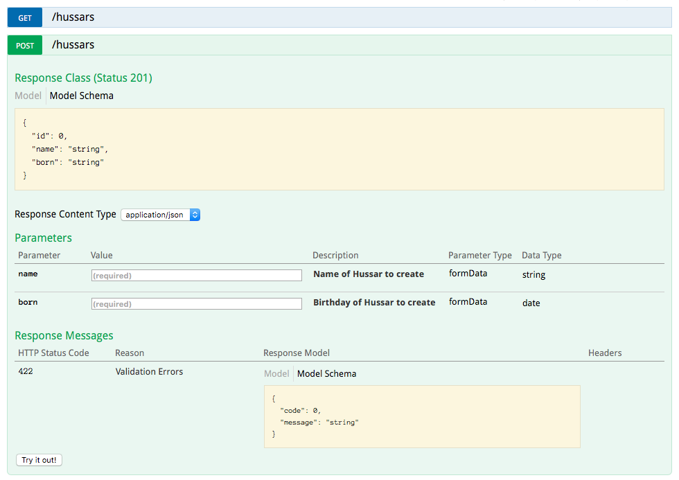

[](http://badge.fury.io/rb/grape-swagger)
[](https://travis-ci.org/ruby-grape/grape-swagger)
[](https://coveralls.io/github/ruby-grape/grape-swagger?branch=master)
[](https://codeclimate.com/github/ruby-grape/grape-swagger)

##### Table of Contents

* [What is grape-swagger?](#what)
* [Related Projects](#related)
* [Compatibility](#version)
* [Swagger-Spec](#swagger-spec)
* [Installation](#install)
* [Usage](#usage)
* [Model Parsers](#model_parsers)
* [Configure](#configure)
* [Routes Configuration](#routes)
* [Using Grape Entities](#grape-entity)
* [Securing the Swagger UI](#oauth)
* [Example](#example)
* [Rake Tasks](#rake)


## What is grape-swagger? <a name="what"></a>

The grape-swagger gem provides an autogenerated documentation for your [Grape](https://github.com/ruby-grape/grape) API. The generated documentation is Swagger-compliant, meaning it can easily be discovered in [Swagger UI](https://github.com/wordnik/swagger-ui). You should be able to point [the petstore demo](http://petstore.swagger.io/) to your API.



This screenshot is based on the [Hussars](https://github.com/LeFnord/hussars) sample app.


## Related Projects <a name="related"></a>

* [Grape](https://github.com/ruby-grape/grape)
* [Grape Swagger Entity](https://github.com/ruby-grape/grape-swagger-entity)
  * [Grape Entity](https://github.com/ruby-grape/grape-entity)
* [Grape Swagger Representable](https://github.com/ruby-grape/grape-swagger-representable)
* [Swagger UI](https://github.com/wordnik/swagger-ui)


## Compatibility <a name="version"></a>

The following versions of grape, grape-entity and grape-swagger can currently be used together.

| grape-swagger | swagger spec | grape                   | grape-entity | representable |
| ------------- | ------------ | ----------------------- | ------------ | ------------- |
| 0.10.5        | 1.2          | >= 0.10.0 ... <= 0.14.0 | < 0.5.0      | n/a           |
| 0.11.0        | 1.2          | >= 0.16.2               | < 0.5.0      | n/a           |
| 0.25.2        | 2.0          | >= 0.14.0 ... <= 0.18.0 | <= 0.6.0     | >= 2.4.1      |
| 0.26.0        | 2.0          | >= 0.16.2 ... <= 1.1.0  | <= 0.6.1     | >= 2.4.1      |
| 0.27.0        | 2.0          | >= 0.16.2 ... <= 1.1.0  | >= 0.5.0     | >= 2.4.1      |
| 0.32.0        | 2.0          | >= 0.16.2               | >= 0.5.0     | >= 2.4.1      |
| 0.34.0        | 2.0          | >= 0.16.2 ... < 1.3.0   | >= 0.5.0     | >= 2.4.1      |
| >= 1.0.0      | 2.0          | >= 1.3.0                | >= 0.5.0     | >= 2.4.1      |


## Swagger-Spec <a name="swagger-spec"></a>

Grape-swagger generates documentation per [Swagger / OpenAPI Spec 2.0](https://github.com/OAI/OpenAPI-Specification/blob/master/versions/2.0.md).

<!-- validating it with: http://bigstickcarpet.com/swagger-parser/www/index.html -->


## Installation <a name="install"></a>

Add to your Gemfile:

```ruby
gem 'grape-swagger'
```

## Upgrade

Please see [UPGRADING](UPGRADING.md) when upgrading from a previous version.


## Usage <a name="usage"></a>

Mount all your different APIs (with `Grape::API` superclass) on a root node. In the root class definition, include `add_swagger_documentation`, this sets up the system and registers the documentation on '/swagger_doc'. See [example/config.ru](example/config.ru) for a simple demo.


```ruby
require 'grape-swagger'

module API
  class Root < Grape::API
    format :json
    mount API::Cats
    mount API::Dogs
    mount API::Pirates
    add_swagger_documentation
  end
end
```

To explore your API, either download [Swagger UI](https://github.com/wordnik/swagger-ui) and set it up yourself or go to the [online swagger demo](http://petstore.swagger.wordnik.com/) and enter your localhost url documentation root in the url field (probably something in the line of http://localhost:3000/swagger_doc).


## Model Parsers <a name="model_parsers"></a>

Since 0.21.0, `Grape::Entity` is not a part of grape-swagger, you need to add `grape-swagger-entity` manually to your Gemfile.
Also added support for [representable](https://github.com/apotonick/representable) via `grape-swagger-representable`.

```ruby
# For Grape::Entity ( https://github.com/ruby-grape/grape-entity )
gem 'grape-swagger-entity', '~> 0.3'
# For representable ( https://github.com/apotonick/representable )
gem 'grape-swagger-representable', '~> 0.2'
```

If you are not using Rails, make sure to load the parser inside your application initialization logic, e.g., via `require 'grape-swagger/entity'` or `require 'grape-swagger/representable'`.

### Custom Model Parsers

You can create your own model parser, for example for [roar](https://github.com/apotonick/roar).

```ruby
module GrapeSwagger
  module Roar
    class Parser
      attr_reader :model
      attr_reader :endpoint

      def initialize(model, endpoint)
        @model = model
        @endpoint = endpoint
      end

      def call
        # Parse your model and return hash with model schema for swagger
      end
    end
  end
end
```

Then you should register your custom parser.

```ruby
GrapeSwagger.model_parsers.register(GrapeSwagger::Roar::Parser, Roar::Decorator)
```

To control model parsers sequence, you can insert your parser before or after another parser.

#### insert_before

```ruby
GrapeSwagger.model_parsers.insert_before(GrapeSwagger::Representable::Parser, GrapeSwagger::Roar::Parser, Roar::Decorator)
```

#### insert_after

```ruby
GrapeSwagger.model_parsers.insert_after(GrapeSwagger::Roar::Parser, GrapeSwagger::Representable::Parser, Representable::Decorator)
```

As we know, `Roar::Decorator` uses `Representable::Decorator` as a superclass, this allows to avoid a problem when Roar objects are processed by `GrapeSwagger::Representable::Parser` instead of `GrapeSwagger::Roar::Parser`.


### CORS

If you use the online demo, make sure your API supports foreign requests by enabling CORS in Grape, otherwise you'll see the API description, but requests on the API won't return. Use [rack-cors](https://github.com/cyu/rack-cors) to enable CORS.

```ruby
require 'rack/cors'
use Rack::Cors do
  allow do
    origins '*'
    resource '*', headers: :any, methods: [ :get, :post, :put, :delete, :options ]
  end
end
```

Alternatively you can set CORS headers in a Grape `before` block.

```ruby
before do
  header['Access-Control-Allow-Origin'] = '*'
  header['Access-Control-Request-Method'] = '*'
end
```


## Configure <a name="configure"></a>

* [host](#host)
* [base_path](#base_path)
* [mount_path](#mount_path)
* [add_base_path](#add_base_path)
* [add_root](#add_root)
* [add_version](#add_version)
* [doc_version](#doc_version)
* [endpoint_auth_wrapper](#endpoint_auth_wrapper)
* [swagger_endpoint_guard](#swagger_endpoint_guard)
* [token_owner](#token_owner)
* [security_definitions](#security_definitions)
* [security](#security)
* [models](#models)
* [tags](#tags)
* [hide_documentation_path](#hide_documentation_path)
* [info](#info)
* [array_use_braces](#array_use_braces)
* [api_documentation](#api_documentation)
* [specific_api_documentation](#specific_api_documentation)

You can pass a hash with optional configuration settings to ```add_swagger_documentation```.
The examples show the default value.


The `host` and `base_path` options also accept a `proc` or a `lambda` to evaluate, which is passed a [request](http://www.rubydoc.info/github/rack/rack/Rack/Request) object:

```ruby
add_swagger_documentation \
  base_path: proc { |request| request.host =~ /^example/ ? '/api-example' : '/api' }
```


#### host: <a name="host"></a>
Sets explicit the `host`, default would be taken from `request`.
```ruby
add_swagger_documentation \
   host: 'www.example.com'
```


#### base_path: <a name="base_path"></a>
Base path of the API that's being exposed, default would be taken from `request`.
```ruby
add_swagger_documentation \
   base_path: nil
```

`host` and `base_path` are also accepting a `proc` or `lambda`


#### mount_path: <a name="mount_path"></a>
The path where the API documentation is loaded, default is: `/swagger_doc`.
```ruby
add_swagger_documentation \
   mount_path: '/swagger_doc'
```

#### add_base_path: <a name="add_base_path"></a>
Add `basePath` key to the documented path keys, default is: `false`.
```ruby
add_swagger_documentation \
   add_base_path: true # only if base_path given
```

#### add_root: <a name="add_root"></a>
Add root element to all the responses, default is: `false`.
```ruby
add_swagger_documentation \
   add_root: true
```

#### add_version: <a name="add_version"></a>

Add `version` key to the documented path keys, default is: `true`,
here the version is the API version, specified by `grape` in [`path`](https://github.com/ruby-grape/grape/#path)

```ruby
add_swagger_documentation \
   add_version: true
```


#### doc_version: <a name="doc_version"></a>

Specify the version of the documentation at [info section](https://github.com/OAI/OpenAPI-Specification/blob/master/versions/2.0.md#info-object), default is: `'0.0.1'`
```ruby
add_swagger_documentation \
   doc_version: '0.0.1'
```


#### endpoint_auth_wrapper: <a name="endpoint_auth_wrapper"></a>

Specify the middleware to use for securing endpoints.

```ruby
add_swagger_documentation \
   endpoint_auth_wrapper: WineBouncer::OAuth2
```


#### swagger_endpoint_guard: <a name="swagger_endpoint_guard"></a>
Specify the method and auth scopes, used by the middleware for securing endpoints.

```ruby
add_swagger_documentation \
   swagger_endpoint_guard: 'oauth2 false'
```


#### token_owner: <a name="token_owner"></a>
Specify the token_owner method, provided by the middleware, which is typically named 'resource_owner'.

```ruby
add_swagger_documentation \
   token_owner: 'resource_owner'
```


#### security_definitions: <a name="security_definitions"></a>
Specify the [Security Definitions Object](https://github.com/OAI/OpenAPI-Specification/blob/master/versions/2.0.md#security-definitions-object)

_NOTE: [Swagger-UI is supporting only implicit flow yet](https://github.com/swagger-api/swagger-ui/issues/2406#issuecomment-248651879)_

```ruby
add_swagger_documentation \
  security_definitions: {
    api_key: {
      type: "apiKey",
      name: "api_key",
      in: "header"
    }
  }
```

#### security: <a name="security"></a>

Specify the [Security Object](https://github.com/OAI/OpenAPI-Specification/blob/master/versions/2.0.md#securityRequirementObject)

```ruby
add_swagger_documentation \
  security: [
    {
      api_key: []
    }
  ]
```


#### models: <a name="models"></a>
A list of entities to document. Combine with the [grape-entity](https://github.com/ruby-grape/grape-entity) gem.

These would be added to the definitions section of the swagger file.

```ruby
add_swagger_documentation \
   models: [
     TheApi::Entities::UseResponse,
     TheApi::Entities::ApiError
   ]
```


#### tags: <a name="tags"></a>

A list of tags to document.  By default tags are automatically generated
for endpoints based on route names.

```ruby
add_swagger_documentation \
  tags: [
    { name: 'widgets', description: 'A description of widgets' }
  ]
```


#### hide_documentation_path: (default: `true`) <a name="hide_documentation_path"></a>

```ruby
add_swagger_documentation \
   hide_documentation_path: true
```

Don't show the `/swagger_doc` path in the generated swagger documentation.


#### info: <a name="info"></a>

```ruby
add_swagger_documentation \
  info: {
    title: "The API title to be displayed on the API homepage.",
    description: "A description of the API.",
    contact_name: "Contact name",
    contact_email: "Contact@email.com",
    contact_url: "Contact URL",
    license: "The name of the license.",
    license_url: "www.The-URL-of-the-license.org",
    terms_of_service_url: "www.The-URL-of-the-terms-and-service.com",
  }
```

A hash merged into the `info` key of the JSON documentation.

#### array_use_braces: <a name="array_use_braces"></a>

```ruby
add_swagger_documentation \
  array_use_braces: true
```
 This setting must be `true` in order for params defined as an `Array` type to submit each element properly.
 ```ruby
params do
  optional :metadata, type: Array[String]
end
```
 with `array_use_braces: true`:
```
metadata[]: { "name": "Asset ID", "value": "12345" }
metadata[]: { "name": "Asset Tag", "value": "654321"}
```
 with `array_use_braces: false`:
```
metadata: {"name": "Asset ID", "value": "123456"}
metadata: {"name": "Asset Tag", "value": "654321"}
```

#### api_documentation

Customize the Swagger API documentation route, typically contains a `desc` field. The default description is "Swagger compatible API description".

```ruby
add_swagger_documentation \
   api_documentation: { desc: 'Reticulated splines API swagger-compatible documentation.' }
```

#### specific_api_documentation

Customize the Swagger API specific documentation route, typically contains a `desc` field. The default description is "Swagger compatible API description for specific API".

```ruby
add_swagger_documentation \
   specific_api_documentation: { desc: 'Reticulated splines API swagger-compatible endpoint documentation.' }
```

## Routes Configuration <a name="routes"></a>

* [Swagger Header Parameters](#headers)
* [Hiding an Endpoint](#hiding)
* [Overriding Auto-Generated Nicknames](#overriding-auto-generated-nicknames)
* [Specify endpoint details](#details)
* [Overriding the route summary](#summary)
* [Overriding the tags](#overriding_the_tags)
* [Deprecating routes](#deprecating-routes)
* [Overriding the name of the body parameter](#body-param)
* [Defining an endpoint as an array](#array)
* [Using an options hash](#options)
* [Overriding parameter type](#overriding-param-type)
* [Overriding data type of the parameter](#overriding-type-of-param)
* [Multiple types](#multiple-types)
* [Array of data type](#array-type)
* [Collection Format](#collection-format)
* [Hiding parameters](#hiding-parameters)
* [Setting a Swagger default value](#default-value)
* [Example parameter value](#param-example)
* [Response documentation](#response)
* [Changing default status codes](#change-status)
* [File response](#file-response)
* [Extensions](#extensions)
* [Response examples documentation](#response-examples)
* [Response headers documentation](#response-headers)
* [Adding root element to responses](#response-root)
* [Multiple present Response](#multiple-response)

#### Swagger Header Parameters  <a name="headers"></a>

Swagger also supports the documentation of parameters passed in the header. Since grape's ```params[]``` doesn't return header parameters we can specify header parameters seperately in a block after the description.

```ruby
desc "Return super-secret information", {
  headers: {
    "XAuthToken" => {
      description: "Valdates your identity",
      required: true
    },
    "XOptionalHeader" => {
      description: "Not really needed",
      required: false
    }
  }
}
```


#### Hiding an Endpoint <a name="hiding"></a>

You can hide an endpoint by adding ```hidden: true``` in the description of the endpoint:

```ruby
desc 'Hide this endpoint', hidden: true
```

Or by adding ```hidden: true``` on the verb method of the endpoint, such as `get`, `post` and `put`:

```ruby
get '/kittens', hidden: true do
```

Or by using a route setting:

```ruby
route_setting :swagger, { hidden: true }
get '/kittens' do
```

Endpoints can be conditionally hidden by providing a callable object such as a lambda which evaluates to the desired
state:

```ruby
desc 'Conditionally hide this endpoint', hidden: lambda { ENV['EXPERIMENTAL'] != 'true' }
```


#### Overriding Auto-Generated Nicknames <a name="overriding-auto-generated-nicknames"></a>

You can specify a swagger nickname to use instead of the auto generated name by adding `:nickname 'string'` in the description of the endpoint.

```ruby
desc 'Get a full list of pets', nickname: 'getAllPets'
```


#### Specify endpoint details <a name="details"></a>

To specify further details for an endpoint, use the `detail` option within a block passed to `desc`:

```ruby
desc 'Get all kittens!' do
  detail 'this will expose all the kittens'
end
get '/kittens' do
```


#### Overriding the route summary <a name="summary"></a>

To override the summary, add `summary: '[string]'` after the description.

```ruby
namespace 'order' do
  desc 'This will be your summary',
    summary: 'Now this is your summary!'
  get :order_id do
    ...
  end
end
```


#### Overriding the tags <a name="overriding_the_tags"></a>

Tags are used for logical grouping of operations by resources or any other qualifier. To override the
tags array, add `tags: ['tag1', 'tag2']` after the description.

```ruby
namespace 'order' do
  desc 'This will be your summary', tags: ['orders']
  get :order_id do
    ...
  end
end
```


#### Deprecating routes <a name="deprecating-routes"></a>

To deprecate a route add `deprecated: true` after the description.

```ruby
namespace 'order' do
  desc 'This is a deprecated route', deprecated: true
  get :order_id do
    ...
  end
end
```


#### Overriding the name of the body parameter <a name="body-param"></a>

By default, body parameters have a generated name based on the operation. For
deeply nested resources, this name can get very long. To override the name of
body parameter add `body_name: 'post_body'` after the description.

```ruby
namespace 'order' do
  desc 'Create an order', body_name: 'post_body'
  post do
    ...
  end
end
```


#### Defining an endpoint as an array <a name="array"></a>

You can define an endpoint as an array by adding `is_array` in the description:

```ruby
desc 'Get a full list of pets', is_array: true
```


#### Using an options hash <a name="options"></a>

The Grape DSL supports either an options hash or a restricted block to pass settings. Passing the `nickname`, `hidden` and `is_array` options together with response codes is only possible when passing an options hash.
Since the syntax differs you'll need to adjust it accordingly:

```ruby
desc 'Get all kittens!', {
  hidden: true,
  is_array: true,
  nickname: 'getKittens',
  success: Entities::Kitten, # or success
  failure: [[401, 'KittenBitesError', Entities::BadKitten]] # or failure
  # also explicit as hash: [{ code: 401, message: 'KittenBitesError', model: Entities::BadKitten }]
  produces: [ "array", "of", "mime_types" ],
  consumes: [ "array", "of", "mime_types" ]
  }
get '/kittens' do
```


#### Overriding parameter type <a name="overriding-param-type"></a>

You can override paramType, using the documentation hash. See [parameter object](https://github.com/OAI/OpenAPI-Specification/blob/master/versions/2.0.md#parameter-object) for available types.

```ruby
params do
  requires :action, type: Symbol, values: [:PAUSE, :RESUME, :STOP], documentation: { param_type: 'query' }
end
post :act do
  ...
end
```


#### Overriding data type of the parameter <a name="overriding-type-of-param"></a>

You can override type, using the documentation hash.

```ruby
params do
  requires :input, type: String, documentation: { type: 'integer' }
end
post :act do
  ...
end
```

```json
{
  "in": "formData",
  "name": "input",
  "type": "integer",
  "format": "int32",
  "required": true
}
```


#### Multiple types <a name="multiple-types"></a>

By default when you set multiple types, the first type is selected as swagger type

```ruby
params do
  requires :action, types: [String, Integer]
end
post :act do
  ...
end
```

```json
{
  "in": "formData",
  "name": "action",
  "type": "string",
  "required": true
}
```


#### Array of data type <a name="array-type"></a>

Array types are also supported.

```ruby
params do
  requires :action_ids, type: Array[Integer]
end
post :act do
  ...
end
```

```json
{
  "in": "formData",
  "name": "action_ids",
  "type": "array",
  "items": {
      "type": "integer"
  },
  "required": true
}
```


#### Collection format of arrays <a name="collection-format"></a>

You can set the collection format of an array, using the documentation hash.

Collection format determines the format of the array if type array is used. Possible values are:
*  csv - comma separated values foo,bar.
*  ssv - space separated values foo bar.
*  tsv - tab separated values foo\tbar.
*  pipes - pipe separated values foo|bar.
*  multi - corresponds to multiple parameter instances instead of multiple values for a single instance foo=bar&foo=baz. This is valid only for parameters in "query" or "formData".

```ruby
params do
  requires :statuses, type: Array[String], documentation: { collectionFormat: 'multi' }
end
post :act do
  ...
end
```

```json
{
  "in": "formData",
  "name": "statuses",
  "type": "array",
  "items": {
      "type": "string"
  },
  "collectionFormat": "multi",
  "required": true
}
```


#### Hiding parameters <a name="hiding-parameters"></a>

Exclude single optional parameter from the documentation

```ruby
not_admins = lambda { |token_owner = nil| token_owner.nil? || !token_owner.admin? }

params do
  optional :one, documentation: { hidden: true }
  optional :two, documentation: { hidden: -> { |t=nil| true } }
  optional :three, documentation: { hidden: not_admins }
end
post :act do
  ...
end
```


#### Setting a Swagger default value <a name="default-value"></a>

Grape allows for an additional documentation hash to be passed to a parameter.

```ruby
params do
  requires :id, type: Integer, desc: 'Coffee ID'
  requires :temperature, type: Integer, desc: 'Temperature of the coffee in celcius', documentation: { default: 72 }
end
```

Grape uses the option `default` to set a default value for optional parameters. This is different in that Grape will set your parameter to the provided default if the parameter is omitted, whereas the example value above will only set the value in the UI itself. This will set the Swagger `defaultValue` to the provided value. Note that the example value will override the Grape default value.

```ruby
params do
  requires :id, type: Integer, desc: 'Coffee ID'
  optional :temperature, type: Integer, desc: 'Temperature of the coffee in celcius', default: 72
end
```

#### Example parameter value <a name="param-example"></a>

The example parameter will populate the Swagger UI with the example value, and can be used for optional or required parameters.

```ruby
params do
  requires :id, type: Integer, documentation: { example: 123 }
  optional :name, type String, documentation: { example: 'Buddy Guy' }
end
```

#### Expose nested namespace as standalone route

Use the `nested: false` property in the `swagger` option to make nested namespaces appear as standalone resources.
This option can help to structure and keep the swagger schema simple.

```ruby
namespace 'store/order', desc: 'Order operations within a store', swagger: { nested: false } do
  get :order_id do
  	...
  end
end
```

All routes that belong to this namespace (here: the `GET /order_id`) will then be assigned to the `store_order` route instead of the `store` resource route.

It is also possible to expose a namespace within another already exposed namespace:

```ruby
namespace 'store/order', desc: 'Order operations within a store', swagger: { nested: false } do
  get :order_id do
  	...
  end
  namespace 'actions', desc: 'Order actions' do, nested: false
    get 'evaluate' do
      ...
    end
  end
end
```
Here, the `GET /order_id` appears as operation of the `store_order` resource and the `GET /evaluate` as operation of the `store_orders_actions` route.


##### With a custom name

Auto generated names for the standalone version of complex nested resource do not have a nice look.
You can set a custom name with the `name` property inside the `swagger` option, but only if the namespace gets exposed as standalone route.
The name should not contain whitespaces or any other special characters due to further issues within swagger-ui.

```ruby
namespace 'store/order', desc: 'Order operations within a store', swagger: { nested: false, name: 'Store-orders' } do
  get :order_id do
  	...
  end
end
```


#### Response documentation <a name="response"></a>

You can also document the HTTP status codes with a description and a specified model, as ref in the schema to the definitions, that your API returns with one of the following syntax.

In the following cases, the schema ref would be taken from route.

```ruby
desc 'thing', failure: [ { code: 400, message: 'Invalid parameter entry' } ]
get '/thing' do
  # ...
end
```

```ruby
desc 'thing' do
  params Entities::Something.documentation
  failure [ { code: 400, message: 'Invalid parameter entry' } ]
end
get '/thing' do
  # ...
end
```

```ruby
get '/thing', failure: [
  { code: 400, message: 'Invalid parameter entry' },
  { code: 404, message: 'Not authorized' },
] do
  # ...
end
```

By adding a `model` key, e.g. this would be taken. Setting an empty string will act like an empty body.
```ruby
get '/thing', failure: [
  { code: 400, message: 'General error' },
  { code: 403, message: 'Forbidden error', model: '' },
  { code: 422, message: 'Invalid parameter entry', model: Entities::ApiError }
] do
  # ...
end
```
If no status code is defined [defaults](/lib/grape-swagger/endpoint.rb#L210) would be taken.

The result is then something like following:

```json
"responses": {
  "200": {
    "description": "get Horses",
    "schema": {
      "$ref": "#/definitions/Thing"
    }
  },
  "401": {
    "description": "HorsesOutError",
    "schema": {
      "$ref": "#/definitions/ApiError"
    }
  }
},
```


#### Changing default status codes <a name="change-status"></a>

The default status codes, one could be found (-> [status codes](lib/grape-swagger/doc_methods/status_codes.rb)) can be changed to your specific needs, to achive it, you have to change it for grape itself and for the documentation.

```ruby
desc 'Get a list of stuff',
    success: { code: 202, model: Entities::UseResponse, message: 'a changed status code' }
get do
  status 202
  # your code comes here
end
```

```json
"responses": {
  "202": {
    "description": "ok",
    "schema": {
      "$ref": "#/definitions/UseResponse"
    }
  }
},
```

#### Multiple status codes for response <a name="multiple-status-response"></a>

Multiple values can be provided for `success` and `failure` attributes in the response.

```ruby
desc 'Attach a field to an entity through a PUT',
    success: [
      { code: 201, model: Entities::UseResponse, message: 'Successfully created' },
      { code: 204, message: 'Already exists' }
    ],
    failure: [
      { code: 400, message: 'Bad request' },
      { code: 404, message: 'Not found' }
    ]
put do
  # your code comes here
end
```

```json
"responses": {
  "201": {
    "description": "Successfully created",
    "schema": {
      "$ref": "#/definitions/UseResponse"
    }
  },
  "204": {
    "description": "Already exists"
  },
  "400": {
    "description": "Bad request"
  },
  "404": {
    "description": "Not found"
  }
},
```


#### File response <a name="file-response"></a>

Setting `success` to `File` sets a default `produces` of `application/octet-stream`.

```ruby
desc 'Get a file',
    success: File
get do
  # your file response
end
```

```json
"produces": [
  "application/octet-stream"
],
"responses": {
  "200": {
    "description": "Get a file",
    "schema": {
      "type": "file"
    }
  }
}
```


#### Extensions <a name="extensions"></a>

Swagger spec2.0 supports extensions on different levels, for the moment,
the documentation on the root level object and the `info`, `verb`, `path` and `definition` levels are supported.

The documented key would be generated from the `x` + `-` + key of the submitted hash,
for possibilities refer to the [extensions spec](spec/lib/extensions_spec.rb).
To get an overview *how* the extensions would be defined on grape level, see the following examples:

- root object extension, add a `x` key to the root hash when calling ```add_swagger_documentation```:
```ruby
  add_swagger_documentation \
    x: {
      some: 'stuff'
    },
    info: {
    }
```
this would generate:
```json
{
  "x-some": "stuff",
  "info":{
  }
}
```

- `info` extension, add a `x` key to the `info` hash when calling ```add_swagger_documentation```:
```ruby
  add_swagger_documentation \
    info: {
      x: { some: 'stuff' }
    }
```
this would generate:
```json
"info":{
  "x-some":"stuff"
}
```

- `verb` extension, add a `x` key to the `desc` hash:
```ruby
desc 'This returns something with extension on verb level',
  x: { some: 'stuff' }
```
this would generate:
```json
"/path":{
  "get":{
    "…":"…",
    "x-some":"stuff"
  }
}
```

- `operation` extension, by setting via route settings::
```ruby
route_setting :x_operation, { some: 'stuff' }
```
this would generate:
```json
"/path":{
  "get":{
    "…":"…",
    "x-some":"stuff"
  }
}
```

- `path` extension, by setting via route settings:
```ruby
route_setting :x_path, { some: 'stuff' }
```
this would generate:
```json
"/path":{
  "x-some":"stuff",
  "get":{
    "…":"…",
  }
}
```

- `definition` extension, again by setting via route settings,
here the status code must be provided, for which definition the extensions should be:
```ruby
route_setting :x_def, { for: 422, other: 'stuff' }
```
this would generate:
```json
"/definitions":{
  "ApiError":{
    "x-other":"stuff",
    "…":"…",
  }
}
```
or, for more definitions:
```ruby
route_setting :x_def, [{ for: 422, other: 'stuff' }, { for: 200, some: 'stuff' }]
```

- `params` extension, add a `x` key to the `documentation` hash :
```ruby
requires :foo, type: String, documentation: { x: { some: 'stuff' } }
```
this would generate:
```json
{
  "in": "formData",
  "name": "foo",
  "type": "string",
  "required": true,
  "x-some": "stuff"
}
```

#### Response examples documentation <a name="response-examples"></a>

You can also add examples to your responses by using the `desc` DSL with block syntax.

By specifying examples to `success` and `failure`.

```ruby
desc 'This returns examples' do
  success model: Thing, examples: { 'application/json' => { description: 'Names list', items: [{ id: '123', name: 'John' }] } }
  failure [[404, 'NotFound', ApiError, { 'application/json' => { code: 404, message: 'Not found' } }]]
end
get '/thing' do
  ...
end
```

The result will look like following:

```json
  "responses": {
    "200": {
      "description": "This returns examples",
      "schema": {
        "$ref": "#/definitions/Thing"
      },
      "examples": {
        "application/json": {
          "description": "Names list",
          "items": [
            {
              "id": "123",
              "name": "John"
            }
          ]
        }
      }
    },
    "404": {
      "description": "NotFound",
      "schema": {
        "$ref": "#/definitions/ApiError"
      },
      "examples": {
        "application/json": {
          "code": 404,
          "message": "Not found"
        }
      }
    }
  }
```

Failure information can be passed as an array of arrays or an array of hashes.

#### Response headers documentation <a name="response-headers"></a>

You can also add header information to your responses by using the `desc` DSL with block syntax.

By specifying headers to `success` and `failure`.

```ruby
desc 'This returns headers' do
  success model: Thing, headers: { 'Location' => { description: 'Location of resource', type: 'string' } }
  failure [[404, 'NotFound', ApiError, { 'application/json' => { code: 404, message: 'Not found' } }, { 'Date' => { description: 'Date of failure', type: 'string' } }]]
end
get '/thing' do
  ...
end
```

The result will look like following:

```json
  "responses": {
    "200": {
      "description": "This returns examples",
      "schema": {
        "$ref": "#/definitions/Thing"
      },
      "headers": {
        "Location": {
          "description": "Location of resource",
          "type": "string"
        }
      }
    },
    "404": {
      "description": "NotFound",
      "schema": {
        "$ref": "#/definitions/ApiError"
      },
      "examples": {
        "application/json": {
          "code": 404,
          "message": "Not found"
        }
      },
      "headers": {
        "Date": {
          "description": "Date of failure",
          "type": "string"
        }
      }
    }
  }
```

Failure information can be passed as an array of arrays or an array of hashes.

#### Adding root element to responses <a name="response-root"></a>

You can specify a custom root element for a successful response:

```ruby
route_setting :swagger, root: 'cute_kitten'
desc 'Get a kitten' do
  http_codes [{ code: 200, model: Entities::Kitten }]
end
get '/kittens/:id' do
end
```

The result will look like following:

```
  "responses": {
    "200": {
      "description": "Get a kitten",
      "schema": {
        "type": "object",
        "properties": { "cute_kitten": { "$ref": "#/definitions/Kitten" } }
      }
    }
  }
```

If you specify `true`, the value of the root element will be deduced based on the model name.
E.g. in the following example the root element will be "kittens":

```ruby
route_setting :swagger, root: true
desc 'Get kittens' do
  is_array true
  http_codes [{ code: 200, model: Entities::Kitten }]
end
get '/kittens' do
end
```

The result will look like following:

```
  "responses": {
    "200": {
      "description": "Get kittens",
      "schema": {
        "type": "object",
        "properties": { "type": "array", "items": { "kittens": { "$ref": "#/definitions/Kitten" } } }
      }
    }
  }
```
#### Multiple present Response <a name="multiple-response"></a>

You can specify a custom multiple response by using the `as` key:
```ruby
desc 'Multiple response',
  success: [
    { model: Entities::EnumValues, as: :gender },
    { model: Entities::Something, as: :somethings }
  ]
end

get '/things' do
  ...
end
```
The result will look like following:
```
  "responses": {
    "200": {
      "description": "Multiple response",
      "schema":{
        "type":"object",
        "properties":{
          "gender":{
            "$ref":"#/definitions/EnumValues"
          },
          "somethings":{
            "$ref":"#/definitions/Something"
          }
        }
      }
    }
  }
```
You can also specify if the response is an array, with the `is_array` key:
```ruby
desc 'Multiple response with array',
  success: [
    { model: Entities::EnumValues, as: :gender },
    { model: Entities::Something, as: :somethings, is_array: true, required: true }
  ]
end

get '/things' do
  ...
end
```
The result will look like following:
```
  "responses": {
    "200": {
      "description": "Multiple response with array",
      "schema":{
        "type":"object",
        "properties":{
          "gender":{
            "$ref":"#/definitions/EnumValues"
          },
          "somethings":{
            "type":"array",
            "items":{
                "$ref":"#/definitions/Something"
            }
          }
        },
        "required": ["somethings"]
      }
    }
  }
```

## Using Grape Entities <a name="grape-entity"></a>

Add the [grape-entity](https://github.com/ruby-grape/grape-entity) and [grape-swagger-entity](https://github.com/ruby-grape/grape-swagger-entity) gem to your Gemfile.

The following example exposes statuses. And exposes statuses documentation adding :type, :desc and :required.
The documented class/definition name could be set via `#entity_name`.

```ruby
module API
  module Entities
    class Status < Grape::Entity
      expose :text, documentation: { type: 'string', desc: 'Status update text.', required: true }
      expose :links, using: Link, documentation: { type: 'link', is_array: true }
      expose :numbers, documentation: { type: 'integer', desc: 'favourite number', values: [1,2,3,4] }
    end

    class Link < Grape::Entity
      expose :href, documentation: { type: 'url' }
      expose :rel, documentation: { type: 'string'}

      def self.entity_name
        'LinkedStatus'
      end

    end
  end

  class Statuses < Grape::API
    version 'v1'

    desc 'Statuses index',
      entity: API::Entities::Status
    get '/statuses' do
      statuses = Status.all
      type = current_user.admin? ? :full : :default
      present statuses, with: API::Entities::Status, type: type
    end

    desc 'Creates a new status',
      entity: API::Entities::Status,
      params: API::Entities::Status.documentation
    post '/statuses' do
        ...
    end
  end
end
```


### Relationships

You may safely omit `type` from relationships, as it can be inferred. However, if you need to specify or override it, use the full name of the class leaving out any modules named `Entities` or `Entity`.


#### 1xN

```ruby
module API
  module Entities
    class Client < Grape::Entity
      expose :name, documentation: { type: 'string', desc: 'Name' }
      expose :addresses, using: Entities::Address,
        documentation: { type: 'Entities::Address', desc: 'Addresses.', param_type: 'body', is_array: true }
    end

    class Address < Grape::Entity
      expose :street, documentation: { type: 'string', desc: 'Street.' }
    end
  end

  class Clients < Grape::API
    version 'v1'

    desc 'Clients index',
      params: Entities::Client.documentation,
      success: Entities::Client
    get '/clients' do
      ...
    end
  end

  add_swagger_documentation
end
```


#### 1x1

Note: `is_array` is `false` by default.

```ruby
module API
  module Entities
    class Client < Grape::Entity
      expose :name, documentation: { type: 'string', desc: 'Name' }
      expose :address, using: Entities::Address,
        documentation: { type: 'Entities::Address', desc: 'Addresses.', param_type: 'body', is_array: false }
    end

    class Address < Grape::Entity
      expose :street, documentation: { type: 'string', desc: 'Street' }
    end
  end

  class Clients < Grape::API
    version 'v1'

    desc 'Clients index',
      params: Entities::Client.documentation,
      success: Entities::Client
    get '/clients' do
      ...
    end
  end

  add_swagger_documentation
end
```

#### Inheritance with allOf and discriminator
```ruby
module Entities
  class Pet < Grape::Entity
    expose :type, documentation: {
      type: 'string',
      is_discriminator: true,
      required: true
    }
    expose :name, documentation: {
      type: 'string',
      required: true
    }
  end

  class Cat < Pet
    expose :huntingSkill, documentation: {
      type: 'string',
      description: 'The measured skill for hunting',
      default: 'lazy',
      values: %w[
        clueless
        lazy
        adventurous
        aggressive
      ]
    }
  end
end
```

Should generate this definitions:
```JSON
{
  "definitions": {
    "Pet": {
      "type": "object",
      "discriminator": "petType",
      "properties": {
        "name": {
          "type": "string"
        },
        "petType": {
          "type": "string"
        }
      },
      "required": [
        "name",
        "petType"
      ]
    },
    "Cat": {
      "description": "A representation of a cat",
      "allOf": [
        {
          "$ref": "#/definitions/Pet"
        },
        {
          "type": "object",
          "properties": {
            "huntingSkill": {
              "type": "string",
              "description": "The measured skill for hunting",
              "default": "lazy",
              "enum": [
                "clueless",
                "lazy",
                "adventurous",
                "aggressive"
              ]
            },
            "petType": {
              "type": "string",
              "enum": ["Cat"]
            }
          },
          "required": [
            "huntingSkill",
            "petType"
          ]
        }
      ]
    }
  }
}
```


## Securing the Swagger UI <a name="oauth"></a>

The Swagger UI on Grape could be secured from unauthorized access using any middleware, which provides certain methods:

- some guard method, which could receive as argument a string or an array of authorization scopes;
- a *before* method to be run in the Grape controller for authorization purpose;
- a set of methods which will process the access token received in the HTTP request headers (usually in the
'HTTP_AUTHORIZATION' header) and try to return the owner of the token.

Below are some examples of securing the Swagger UI on Grape installed along with Ruby on Rails:

- The WineBouncer and Doorkeeper gems are used in the examples;
- 'rails' and 'wine_bouncer' gems should be required prior to 'grape-swagger' in boot.rb;
- This works with a fresh PR to WineBouncer which is yet unmerged - [WineBouncer PR](https://github.com/antek-drzewiecki/wine_bouncer/pull/64).

This is how to configure the grape_swagger documentation:

```ruby
  add_swagger_documentation base_path: '/',
                            title: 'My API',
                            doc_version: '0.0.1',
                            hide_documentation_path: true,
                            endpoint_auth_wrapper: WineBouncer::OAuth2, # This is the middleware for securing the Swagger UI
                            swagger_endpoint_guard: 'oauth2 false',     # this is the guard method and scope
                            token_owner: 'resource_owner'               # This is the method returning the owner of the token
```

The guard method should inject the Security Requirement Object into the endpoint's route settings (see Grape::DSL::Settings.route_setting method).

The 'oauth2 false' added to swagger_documentation is making the main Swagger endpoint protected with OAuth, i.e. the
access_token is being retreiving from the HTTP request, but the 'false' scope is for skipping authorization and
showing the UI for everyone. If the scope would be set to something else, like 'oauth2 admin', for example, than the UI
 wouldn't be displayed at all to unauthorized users.

Further on, the guard could be used, where necessary, for endpoint access protection. Put it prior to the endpoint's method:

```ruby
  resource :users do
    oauth2 'read, write'
    get do
      render_users
    end

    oauth2 'admin'
    post do
      User.create!...
    end
  end
```

And, finally, if you want to not only restrict the access, but to completely hide the endpoint from unauthorized
users, you could pass a lambda to the :hidden key of a endpoint's description:

```ruby
  not_admins = lambda { |token_owner = nil| token_owner.nil? || !token_owner.admin? }

  resource :users do
    desc 'Create user', hidden: not_admins
    oauth2 'admin'
    post do
      User.create!...
    end
  end
```

The lambda is checking whether the user is authenticated (if not, the token_owner is nil by default), and has the admin
role - only admins can see this endpoint.


## Example <a name="example"></a>

Go into example directory and run it: `$ bundle exec rackup`
go to: `http://localhost:9292/swagger_doc` to get it

For request examples load the [postman file]()

#### Grouping the API list using Namespace

Use namespace for grouping APIs


#### Example Code

```ruby
class NamespaceApi < Grape::API
  namespace :hudson do
    desc 'Document root'
    get '/' do
    end

    desc 'This gets something.',
      detail: '_test_'

    get '/simple' do
      { bla: 'something' }
    end
  end

  namespace :download do
    desc 'download files',
         success: File,
         produces: ['text/csv']
    get ':id' do
      # file response
    end
  end
end
  …

```


## Rake Tasks <a name="rake"></a>

Add these lines to your Rakefile, and initialize the Task class with your Api class.

```ruby
require 'grape-swagger/rake/oapi_tasks'
GrapeSwagger::Rake::OapiTasks.new(::Api::Base)
```

You may initialize with the class name as a string if the class is not yet loaded at the time Rakefile is parsed:
```ruby
require 'grape-swagger/rake/oapi_tasks'
GrapeSwagger::Rake::OapiTasks.new('::Api::Base')
```

#### OpenApi/Swagger Documentation

```
rake oapi:fetch
params:
- store={ true | file_name } – save as JSON (optional)
- resource=resource_name     – get only for this one (optional)
```

#### OpenApi/Swagger Validation

**requires**: `npm` and `swagger-cli` to be installed


```
rake oapi:validate
params:
- resource=resource_name – get only for this one (optional)
```


## Contributing to grape-swagger

See [CONTRIBUTING](CONTRIBUTING.md).

## Copyright and License

Copyright (c) 2012-2016 Tim Vandecasteele, ruby-grape and contributors. See [LICENSE.txt](LICENSE.txt) for details.
