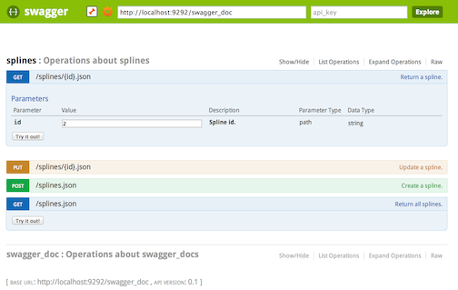

# grape-swagger

## *don't us it, it is a work in progress version, to upgrade to swagger 2.0 spec*

[](http://badge.fury.io/rb/grape-swagger)
[](https://travis-ci.org/ruby-grape/grape-swagger)
[](https://gemnasium.com/ruby-grape/grape-swagger)
[](https://codeclimate.com/github/ruby-grape/grape-swagger)

## What is grape-swagger?

The grape-swagger gem provides an autogenerated documentation for your [Grape](https://github.com/ruby-grape/grape) API. The generated documentation is Swagger-compliant, meaning it can easily be discovered in [Swagger UI](https://github.com/wordnik/swagger-ui). You should be able to point [the petstore demo](http://petstore.swagger.io/) to your API.



## Related Projects

* [Grape](https://github.com/ruby-grape/grape)
* [Swagger UI](https://github.com/wordnik/swagger-ui)

## Swagger-Spec

Grape-swagger generates documentation per [Swagger Spec 1.2](https://github.com/swagger-api/swagger-spec/blob/master/versions/1.2.md).

## Installation

Add to your Gemfile:

```gem 'grape-swagger'```

## Upgrade

Please see [UPGRADING](UPGRADING.md) when upgrading from a previous version.

## Usage

Mount all your different APIs (with ```Grape::API``` superclass) on a root node. In the root class definition, include ```add_swagger_documentation```, this sets up the system and registers the documentation on '/swagger_doc'. See [example/api.rb](example/api.rb) for a simple demo.


``` ruby
require 'grape-swagger'

module API
  class Root < Grape::API
    mount API::Cats
    mount API::Dogs
    mount API::Pirates
    add_swagger_documentation
  end
end
```

To explore your API, either download [Swagger UI](https://github.com/wordnik/swagger-ui) and set it up yourself or go to the [online swagger demo](http://petstore.swagger.wordnik.com/) and enter your localhost url documentation root in the url field (probably something in the line of http://localhost:3000/swagger_doc).

### CORS

If you use the online demo, make sure your API supports foreign requests by enabling CORS in Grape, otherwise you'll see the API description, but requests on the API won't return. Use [rack-cors](https://github.com/cyu/rack-cors) to enable CORS.

```` ruby
require 'rack/cors'
use Rack::Cors do
  allow do
    origins '*'
    resource '*', headers: :any, methods: [ :get, :post, :put, :delete, :options ]
  end
end
```

Alternatively you can set CORS headers in a Grape `before` block.

``` ruby
before do
  header['Access-Control-Allow-Origin'] = '*'
  header['Access-Control-Request-Method'] = '*'
end
````

## Configure

You can pass a hash with optional configuration settings to ```add_swagger_documentation```.

#### target_class

The API class to document, default `self`.

#### mount_path

The path where the API documentation is loaded, default is `/swagger_doc`.

#### class_name

API class name.

#### markdown

Allow markdown in `detail`/`notes`, default is `nil`. (disabled) See below for details.

#### hide_format

~~Don't add `.(format)` to the end of URLs, default is `false`.~~  
`.(format)` would always be removed.

#### api_version

Version of the API that's being exposed.

#### base_path

Base path of the API that's being exposed. This configuration parameter accepts a `proc` to evaluate `base_path`, useful when you need to use request attributes to determine its value.

#### authorizations

This value is added to the `authorizations` key in the JSON documentation.

#### root_base_path

Add `basePath` key to the JSON documentation, default is `true`.

#### models

A list of entities to document. Combine with the [grape-entity](https://github.com/ruby-grape/grape-entity) gem. See below for details.

#### hide_documentation_path

Don't show the `/swagger_doc` path in the generated swagger documentation.

#### format

Documentation response format, default is `:json`.

#### info

A hash merged into the `info` key of the JSON documentation. This may contain:

* `:title`: The API title to be displayed on the API homepage.
* `:description`: A description of the API.
* `:contact`: Contact email.
* `:license`: The name of the license.
* `:license_url`: The URL of the license.
* `:terms_of_service_url`: The URL of the API terms and conditions.

#### api_documentation

Customize the Swagger API documentation route, typically contains a `desc` field. The default description is "Swagger compatible API description".

``` ruby
add_swagger_documentation \
   api_documentation: { desc: 'Reticulated splines API swagger-compatible documentation.' }
```

#### specific_api_documentation

Customize the Swagger API specific documentation route, typically contains a `desc` field. The default description is "Swagger compatible API description for specific API".

``` ruby
add_swagger_documentation \
   specific_api_documentation: { desc: 'Reticulated splines API swagger-compatible endpoint documentation.' }
```

## Swagger Header Parameters

Swagger also supports the documentation of parameters passed in the header. Since grape's ```params[]``` doesn't return header parameters we can specify header parameters seperately in a block after the description.

``` ruby
desc "Return super-secret information", {
  headers: {
    "XAuthToken" => {
      description: "Valdates your identity",
      required: true
    },
    "XOptionalHeader" => {
      description: "Not really needed",
      required: false
    }
  }
}
```

## Hiding an Endpoint

You can hide an endpoint by adding ```hidden: true``` in the description of the endpoint:

``` ruby
desc 'Hide this endpoint', hidden: true
```

Endpoints can be conditionally hidden by providing a callable object such as a lambda which evaluates to the desired
state:

``` ruby
desc 'Conditionally hide this endpoint', hidden: lambda { ENV['EXPERIMENTAL'] != 'true' }
```

## Overriding Auto-Generated Nicknames

You can specify a swagger nickname to use instead of the auto generated name by adding `:nickname 'string'``` in the description of the endpoint.

``` ruby
desc 'Get a full list of pets', nickname: 'getAllPets'
```

## Defining an endpoint as array

You can define an endpoint as array by adding `is_array` in the description:

``` ruby
desc 'Get a full list of pets', is_array: true
```

## Using an options hash

The Grape DSL supports either an options hash or a restricted block to pass settings. Passing the `nickname`, `hidden` and `is_array` options together with response codes is only possible when passing an options hash.
Since the syntax differs you'll need to adjust it accordingly:

``` ruby
desc 'Get all kittens!', {
  :hidden => true,
  :is_array => true,
  :nickname => 'getKittens',
  :entity => Entities::Kitten, # use entity instead of success
  :http_codes => [[401, 'KittenBitesError', Entities::BadKitten]]  # use http_codes instead of failure
  }
get '/kittens' do
```

## Specify endpoint details

To specify further details for an endpoint, use the `detail` option within a block passed to `desc`:

``` ruby
desc 'Get all kittens!' do
  detail 'this will expose all the kittens'
end
get '/kittens' do
```

## Overriding param type

You can override paramType in POST|PUT methods to query, using the documentation hash.

``` ruby
params do
  requires :action, type: Symbol, values: [:PAUSE, :RESUME, :STOP], documentation: { param_type: 'query' }
end
post :act do
  ...
end
```

## Expose nested namespace as standalone route
Use the `nested: false` property in the `swagger` option to make nested namespaces appear as standalone resources.
This option can help to structure and keep the swagger schema simple.

    namespace 'store/order', desc: 'Order operations within a store', swagger: { nested: false } do
      get :order_id do
      	...
      end
    end

All routes that belong to this namespace (here: the `GET /order_id`) will then be assigned to the `store_order` route instead of the `store` resource route.

It is also possible to expose a namspace within another already exposed namespace:

    namespace 'store/order', desc: 'Order operations within a store', swagger: { nested: false } do
      get :order_id do
      	...
      end
      namespace 'actions', desc: 'Order actions' do, nested: false
        get 'evaluate' do
          ...
        end
      end
    end

Here, the `GET /order_id` appears as operation of the `store_order` resource and the `GET /evaluate` as operation of the `store_orders_actions` route.

### With a custom name
Auto generated names for the standalone version of complex nested resource do not have a nice look.
You can set a custom name with the `name` property inside the `swagger` option, but only if the namespace gets exposed as standalone route.
The name should not contain whitespaces or any other special characters due to further issues within swagger-ui.

    namespace 'store/order', desc: 'Order operations within a store', swagger: { nested: false, name: 'Store-orders' } do
      get :order_id do
      	...
      end
    end

## Additional documentation

## Setting a Swagger defaultValue

Grape allows for an additional documentation hash to be passed to a parameter.

    params do
      requires :id, type: Integer, desc: 'Coffee ID'
      requires :temperature, type: Integer, desc: 'Temperature of the coffee in celcius', documentation: { example: 72 }
    end

The example parameter will populate the Swagger UI with the example value, and can be used for optional or required parameters.

Grape uses the option `default` to set a default value for optional parameters. This is different in that Grape will set your parameter to the provided default if the parameter is omitted, whereas the example value above will only set the value in the UI itself. This will set the Swagger `defaultValue` to the provided value. Note that the example value will override the Grape default value.


    params do
      requires :id, type: Integer, desc: 'Coffee ID'
      optional :temperature, type: Integer, desc: 'Temperature of the coffee in celcius', default: 72
    end


## Grape Entities

Add the [grape-entity](https://github.com/agileanimal/grape-entity) gem to our Gemfile.

The following example exposes statuses. And exposes statuses documentation adding :type and :desc.

```ruby
module API
  module Entities
    class Status < Grape::Entity
      expose :text, documentation: { type: 'string', desc: 'Status update text.' }
      expose :links, using: Link, documentation: { type: 'link', is_array: true }
      expose :numbers, documentation: { type: 'integer', desc: 'favourite number', values: [1,2,3,4] }
    end

    class Link < Grape::Entity
      def self.entity_name
        'link'
      end

      expose :href, documentation: { type: 'url' }
      expose :rel, documentation: { type: 'string'}
    end
  end

  class Statuses < Grape::API
    version 'v1'

    desc 'Statuses index', entity: API::Entities::Status
    get '/statuses' do
      statuses = Status.all
      type = current_user.admin? ? :full : :default
      present statuses, with: API::Entities::Status, type: type
    end

    desc 'Creates a new status', entity: API::Entities::Status, params: API::Entities::Status.documentation
    post '/statuses' do
        ...
    end
  end
end
```

### Relationships

You may safely omit `type` from relationships, as it can be inferred. However, if you need to specify or override it, use the full name of the class leaving out any modules named `Entities` or `Entity`.

#### 1xN

```ruby
module API
  module Entities
    class Client < Grape::Entity
      expose :name, documentation: { type: 'string', desc: 'Name' }
      expose :addresses, using: Entities::Address,
        documentation: { type: 'API::Address', desc: 'Addresses.', param_type: 'body', is_array: true }
    end

    class Address < Grape::Entity
      expose :street, documentation: { type: 'string', desc: 'Street.' }
    end
  end

  class Clients < Grape::API
    version 'v1'

    desc 'Clients index', params: Entities::Client.documentation
    get '/clients' do
      ...
    end
  end

  add_swagger_documentation models: [Entities::Client, Entities::Address]
end
```

#### 1x1

Note: `is_array` is `false` by default.

```ruby
module API
  module Entities
    class Client < Grape::Entity
      expose :name, documentation: { type: 'string', desc: 'Name' }
      expose :address, using: Entities::Address,
        documentation: { type: 'API::Address', desc: 'Addresses.', param_type: 'body', is_array: false }
    end

    class Address < Grape::Entity
      expose :street, documentation: { type: 'string', desc: 'Street' }
    end
  end

  class Clients < Grape::API
    version 'v1'

    desc 'Clients index', params: Entities::Client.documentation
    get '/clients' do
      ...
    end
  end

  add_swagger_documentation models: [Entities::Client, Entities::Address]
end
```

## Markdown in Detail/Notes

The grape-swagger gem allows you to add an explanation in markdown in the detail/notes field. Which would result in proper formatted markdown in Swagger UI.
Grape-swagger uses adapters for several markdown formatters. It includes adapters for [kramdown](http://kramdown.rubyforge.org) (kramdown [syntax](http://kramdown.rubyforge.org/syntax.html)) and [redcarpet](https://github.com/vmg/redcarpet).
The adapters are packed in the GrapeSwagger::Markdown modules. We do not include the markdown gems in our gemfile, so be sure to include or install the depended gems.


### Kramdown
If you want to use kramdown as markdown formatter, you need to add kramdown to your gemfile.

```
gem 'kramdown'
```

Configure your api documentation route with:


``` ruby
add_swagger_documentation(
  markdown: GrapeSwagger::Markdown::KramdownAdapter
)
```

Finally you can write endpoint descriptions the with markdown enabled.

``` ruby
desc "Reserve a burger in heaven" do
  detail <<-NOTE
    Veggie Burgers in Heaven
    -----------------

    > A veggie burger doesn't come for free

    If you want to reserve a veggie burger in heaven, you have to do
    some crazy stuff on earth.

        def do_good
          puts 'help people'
        end

    * _Will go to Heaven:_ Probably
    * _Will go to Hell:_ Probably not
  NOTE
end
```

### Redcarpet
As alternative you can use [redcarpet](https://github.com/vmg/redcarpet) as formatter, you need to include redcarpet in your gemspec. If you also want to use [rouge](https://github.com/jneen/rouge) as syntax highlighter you also need to include it.

```
gem 'redcarpet'
gem 'rouge'
```

Configure your api documentation route with:

``` ruby
add_swagger_documentation(
  markdown: GrapeSwagger::Markdown::RedcarpetAdapter.new(render_options: { highlighter: :rouge })
)
```

Alternatively you can disable rouge by adding `:none` as highlighter option. You can add redcarpet extensions and render options trough the `extenstions:` and `render_options:` parameters.

### Custom markdown formatter
You can also add your custom adapter for your favourite markdown formatter, as long it responds to the method `markdown(text)` and it formats the given text.

``` ruby
module API

  class MySuperbMarkdownFormatterAdapter
   attr_reader :adapter

   def initialize(options)
    require 'superbmarkdownformatter'
    @adapter = SuperbMarkdownFormatter.new options
   end

   def markdown(text)
      @adapter.render_supreme(text)
   end
  end

  add_swagger_documentation markdown: MySuperbMarkdownFormatterAdapter.new(no_links: true)
end

```

## Response documentation

You can also document the HTTP status codes with a description ~~and a specified model~~ that your API returns with one of the following syntax.

``` ruby
desc 'thing', http_codes: [ { code: 400, message: "Invalid parameter entry" } ]
get '/thing' do
  ...
end
```

``` ruby
desc 'thing' do
  params Entities::Something.documentation
  http_codes [ { code: 400, message: "Invalid parameter entry" } ]
end
get '/thing' do
  ...
end
```

``` ruby
get '/', http_codes: [
  { code: 200, message: 'Ok' },
  { code: 400, message: "Invalid parameter entry" }
] do
  ...
end
```

If no status code is defined [defaults](/lib/grape-swagger/endpoint.rb#L121) would be taken.


## Contributing to grape-swagger

See [CONTRIBUTING](CONTRIBUTING.md).

## Copyright and License

Copyright (c) 2012-2014 Tim Vandecasteele and contributors. See [LICENSE.txt](LICENSE.txt) for details.
